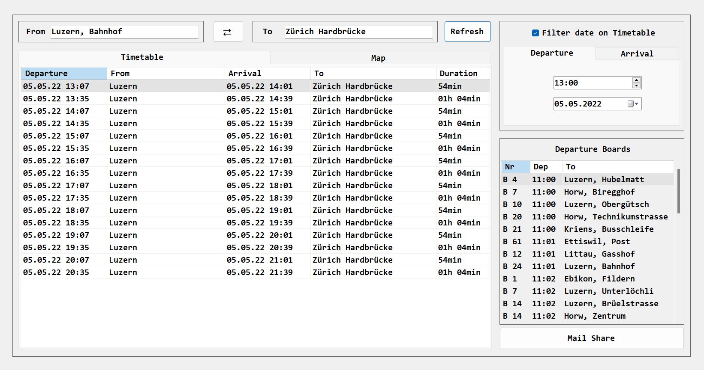

 Yannic Studer | 09.05.2022</p1>
<h1 align="center"> Dokumentation M318</h1>

<h2 align="left"> Inhaltsverzeichnis</h1>

 - [Einleitung](#einl)
 - [Erreichte Ziele](#erre)
 - [Mockup](#mock)
 - [User Story](#user)
 - [Aktivitätsdiagramm](#aktiv)
 - [Testfälle](#test)
 - [Testprotokoll](#testproto)
 - [Installationsanleitung](#instal)

  <!--  - [Andere](#more) -->

 

<h2>Einleitung</h2>

Am 29.04.2022 habe ich am Überbetrieblichen-Kurs, welcher das Modul 318 behandelt, teilgenommen. Die Benotung des Moduls wurde durch eine praktische Arbeit bestimmt. Im Unterricht bekamen wir deswegen eine simulierte Anforderung über. Die Anforderung war eine Applikation, welche die ÖV-Verbindungen anzeigt und zusätzliche Wünsche des Kunden erfüllt. Beispielsweise eine Maps-Einbindung oder eine Möglichkeit die Verbindung via Mail zu teilen. Ausserdem hat die imaginäre Firma eine strickte Sicherheit weswegen «nur» Windows-Maschinen ohne Webbrowser benutzt werden.

<h2>Erreichte Ziele</h2>

| Ziel                       | Kommentar                      |
|----------------------------|--------------------------------|
| Start - Endstation         | Funktioniert einwandfrei       |
| Start - Endstation Eingabe | Funktioniert einwandfrei       |
| Abfahrtstafel              | Funktioniert einwandfrei       |
| Automatisch ausfüllen      | Funktioniert, fast einwandfrei |
| Filter Suche               | Funktioniert einwandfrei       |
| Google Maps                | Funktioniert, fast einwandfrei |
| Mail Share                 | Funktioniert, einwandfrei      |
| Eigene Idee:               | Funktioniert, einwandfrei      |

 

<h2>Mockup</h2>

Als Mockup Inspiration habe ich definitiv die `SBB-Mobile-App` genutzt. Ich wollte viele Elemente übernehmen, weswegen ich mein Layout öfters anpassen musste. Die Idee war simpel, das Programm soll zwei Eingabefenster haben, in denen man den Standort und den gewünschten Zielort eingeben kann. Dazu mehrere Datenflächen, auf denen dann die Informationen ausgegeben kann. Aufgrund von WindowsForms konnte ich viele Ideen nicht umsetzten, weswegen ich meine Anforderungen etwas niedriger setzten musste. Zu Beginn sollten Fahrplan und Karte, Knöpfe sein, die bei Knopfdruck dann den gewünschten Inhalt anzeigen, jedoch war es einfacher ein TabControl einzubauen, in dem TabControl hat man ungefähr die gleichen Funktionen wie im Browser weswegen es einfacher zu bedienen ist. Ein Refresh-Knopf war zu Beginn auch nicht geplant, jedoch war es zu Ressourcen intensiv bei jeder Tasteneingabe eine Abfrage zu tätigen, weswegen schlussendlich doch ein Refresh-Knopf hermusste.

[ SBB Mobile App ](https://play.google.com/store/apps/details?id=ch.sbb.mobile.android.b2c&hl=en&gl=US)

  
  
[ Picture of Mockup Idea ]

  
  
[ Picture of the final Result ]

---

 

<h2>User Story</h2>

|ID & Titel                      | User Story                                                               | Abnahmekriterien                                     | Priorität       |
|--------------------------------|--------------------------------------------------------------------------|------------------------------------------------------|-----------------|
| 1. Start - Endstation          | Als Nutzer möchte ich die Startstation und Endstation eingeben können. | Die Orte werden gesucht und korrekt erkannt. |1|
| 2. Start - Endstation Eingabe  | Als Nutzer möchte man die Verbindung wischen Start- und Endstation der ÖV wissen. | Verbindungen zu den Orten werden gesucht, Ergebnisse werden ausgegeben |1|
| 3. Abfahrtstafel               | Als Nutzer möchte ich eine Abfahrtstafel haben, damit ich sehen kann wann welche Fahrzeuge abfahren. | Es gibt eine Abfahrtstafel die sich mit der Startstation synchronisiert und die Ergebnisse ausgibt|1|
| 4. Automatisch ausfüllen       | Als Nutzer der Applikation möchte ich das sich Stationen automatisch ausfüllen oder es Vorschläge gibt. | Die Vorschläge erscheinen und man kann sie Anklicken zum auswählen. |1|
| 5. Filter Suche                | Als Nutzer möchte ich in der App ein Datum und Uhrzeit eingeben damit ich meine Verbindungen auch in der Zukunft finde. | Das Datum kann auf tag und Uhrzeit gefilter werden  |2|
| 6. Google Maps                 | Als Nutzer möchte ich auf einer Karte sehen können wo sich meine aktuelle Station und meine nächste Station befinden. | Im Program gibt es eine Karte auf dieser Sationen markiert sind. |2|
| 7. Mail Share                  | Als Nutzer möchte ich meine Verbindungen meinen Mitarbeitern Teilel können. (via Mail) | Programm öffnet Mail und schreibt die ausgewählte Verbindung hinein. |3|
| 8. Eigene Idee: Switch-Knopf   | Als Nutzer möchte ich einen Knopf drücken, der meine Start- und Endstation vertauscht. | Der Knopf funktioniert zuverlässig und ohne Datenverlust |3|

 

<h2>Aktivitätsdiagramm</h2>

Dieses Aktivitätsdiagramm bezieht sich auf die 4. User Story. 
Der Benutzer gibt eine Eingabe ein, welche mit Hilfe von getStations verglichen wird.
Wird eine Station gefunden kommt der Vorschlag oder die Vorschläge in die TextBox zur Visualisierung der Ergebnisse. 
Wird keine Station gefunden kommt der Text «No Result» in die TextBox.

  
  
[ Picture of Flowchart ]

<h2>Testfälle</h2>

|Schritt| Aktivität                                          | Erwartetes Resultat                                  |
|-------|----------------------------------------------------|------------------------------------------------------|
| 1     | Öffnen Sie das Programm                            | Kein Fehler                                          |
| 2     | Klicken Sie auf die From Suchbar                   | Kein Fehler und noch kein Dropdown                   |
| 3     | Geben Sie in der From Suchbar einen Buchstaben ein | Kein Fehler und aber ein Dropdown                    |
| 4     | Klicken Sie auf die To Suchbar                     | Kein Fehler und aber ein Dropdown                    |
| 5     | Geben Sie in der To Suchbar einen Buchstaben ein   | Kein Fehler und aber ein Dropdown                    |
| 6     | Geben Sie in der From Suchbar Test123456789 ein    | No Result in dem Dropdown                            |
| 7     | Geben Sie in der To Suchbar Test123456789 ein      | No Result in dem Dropdown                            |
| 8     | Geben Sie in der From Suchbar zwei echte Orte ein  | Kein Fehler, Strassenempfehlung                      |
| 9     | Geben Sie in der To Suchbar zwei echte Orte ein    | Kein Fehler, Strassenempfehlung                      |
| 10    | Klicken sie auf den Refresh Knopf                  | Resultate erscheinen in Timeplan und Departure Board |

 

<h2>Testprotokoll</h2>

-

 

<h2>Installationsanleitung</h2>

Um das Programm auszuführen, können sie entweder das komplette Projekt unter Code herunterladen oder unter Clone klonen. Falls Sie nur die finale .exe Datei haben möchten, können Sie auf Download Latest klicken und die final.zip Datei herunterladen.

[- Download Latest Here](/doc/fin)

 

### VisualStudio
In VisualStudio müssen Sie zuerst die `.snl Datei` öffnen und danach `SwissTransportUI` als `Startprojekt festlegen`. Dann können Sie `F5 drücken`, um das Programm zu starten.

### Final.zip
Nachdem Sie die `final.zip` Datei heruntergeladen haben, müssen Sie die Datei `extrahieren`. (Empfohlen wird 7-Zip oder Winrar)
Danach können Sie problemlos die `.exe Datei` ausführen.

